# 📍 User Journeys — RedCAD Hub

> This document maps **every interaction** a user can have with the platform, organized by actor and journey. Every screen state, decision point, error path, edge case, and data dependency is documented.

---

## Actors

| Actor | Role | Auth Source | Entry |
|-------|------|-------------|:-----:|
| **CAD User** | Coordinator at a Centro de Alineamiento de Datos. Manages their org's profile, fills the diagnostic form, and browses the network directory | `cad_users_mapping` table linking `user_email` → `cad_id` | `/login` |
| **Admin (Secretaría Técnica)** | Platform administrator. Full access to all CADs, can create/delete CADs, reset passwords, view/edit any CAD's profile and form | `user_roles.role === 'admin'` OR `admin_users_mapping` table | `/login` |
| **Visitor** | Unauthenticated user | None | `/` → redirected to `/login` |

### Key Difference Between Actors

| Capability | CAD User | Admin |
|-----------|:--------:|:-----:|
| See own profile | ✅ | ✅ (if has linked CAD) |
| Edit own profile | ✅ | ✅ (if has linked CAD) |
| See/edit **any** CAD's profile | ❌ | ✅ (via `?cad_id=X`) |
| Fill own diagnostic form | ✅ | ✅ (if has linked CAD) |
| Fill **any** CAD's form | ❌ | ✅ (via `?cad_id=X`) |
| Browse directory | ✅ | ✅ |
| View CAD detail pages | ✅ | ✅ |
| See "Panel Admin" in navbar | ❌ | ✅ |
| See "Panel Admin" card on dashboard | ❌ | ✅ |
| Create new CAD | ❌ | ✅ |
| Delete CAD | ❌ | ✅ |
| Reset any CAD's password | ❌ | ✅ |
| Manage admin team members | ❌ | ✅ |
| Manage CAD team members | ✅ (own CAD) | ✅ (any CAD) |

---

# Part 1: Shared Journeys (Both User Types)

---

## J1. Authentication

### J1.1 Login Flow

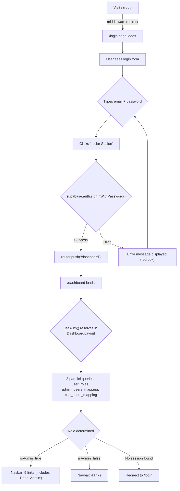
```mermaid
flowchart TD
    A["Visit / (root)"] -->|middleware redirect| B["/login page loads"]
    B --> C["User sees login form"]
    C --> D{"Types email + password"}
    D --> E["Clicks 'Iniciar Sesión'"]
    E --> F{"supabase.auth.signInWithPassword()"}
    F -->|Success| G["router.push('/dashboard')"]
    F -->|Error| H["Error message displayed (red box)"]
    H --> D
    
    G --> I["/dashboard loads"]
    I --> J{"useAuth() resolves in DashboardLayout"}
    J --> K["3 parallel queries: user_roles, admin_users_mapping, cad_users_mapping"]
    K --> L{"Role determined"}
    L -->|isAdmin=true| M["Navbar: 5 links (includes 'Panel Admin')"]
    L -->|isAdmin=false| N["Navbar: 4 links"]
    L -->|No session found| O["Redirect to /login"]
```

#### Screen States — `/login`

| State | What User Sees | Trigger | Exit |
|-------|---------------|---------|------|
| **Default** | Email + password inputs, "Instrucciones de Acceso" box, "Iniciar Sesión" button | Page load | User types + clicks submit |
| **Loading** | Button → "Entrando...", all inputs disabled | Submit click | Auth response returns |
| **Error** | Red-bordered message box below form with error text | Invalid credentials | User retries |
| **Success** | Brief flash, then redirect to `/dashboard` | Valid credentials | Router pushes to /dashboard |
| **Dev Mode** | Two extra buttons: "⚡ Acceso Rápido Administrador", "🌱 Acceso Rápido CAD" | `NEXT_PUBLIC_DEV_MODE=true` | Click either button |

#### Edge Cases
| Case | What Happens |
|------|-------------|
| Empty email/password submit | Browser native HTML5 `required` validation blocks submit |
| Spaces in email/password | `.trim()` applied before auth call |
| Valid email, wrong password | "Credenciales incorrectas: Invalid login credentials" |
| Non-existent email | Same error as wrong password (Supabase doesn't distinguish) |
| Network offline | `supabase.auth` throws → error message shown |
| Session already exists (user visits /login while logged in) | Login form shown anyway — no redirect to dashboard |
| Tab left open, session expires | `onAuthStateChange` fires `SIGNED_OUT` → redirect to /login |
| Login in another tab | `onAuthStateChange` fires `SIGNED_IN` → `resolveAuth()` re-runs |

---

### J1.2 Logout Flow

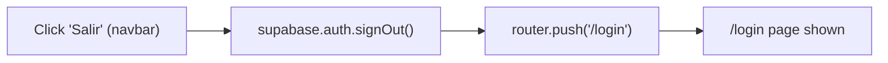
```mermaid
flowchart LR
    A["Click 'Salir' (navbar)"] --> B["supabase.auth.signOut()"]
    B --> C["router.push('/login')"]
    C --> D["/login page shown"]
```

#### Where "Salir" is Available
- **Desktop**: Top-right area of navbar (pill button with LogOut icon)
- **Mobile**: Bottom of slide-out sidebar menu (full-width red-outlined button)

#### Edge Cases
| Case | What Happens |
|------|-------------|
| Click "Salir" while form has unsaved changes | `beforeunload` fires → browser warns (profile + form pages) |
| Click "Salir" on dashboard (no unsaved changes) | Immediate logout, no warning |
| Session already expired when "Salir" clicked | `signOut()` still succeeds → redirects to login |
| Logout in one tab, other tab open | `onAuthStateChange` → `SIGNED_OUT` → other tab redirects to /login |

---

### J1.3 Auth Resolution (Background Process)

This happens automatically on **every protected page load** via the `useAuth()` hook:

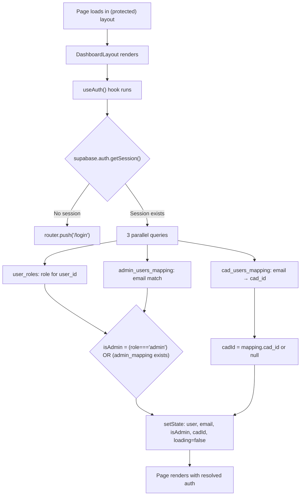
```mermaid
flowchart TD
    A["Page loads in (protected) layout"] --> B["DashboardLayout renders"]
    B --> C["useAuth() hook runs"]
    C --> D{"supabase.auth.getSession()"}
    D -->|No session| E["router.push('/login')"]
    D -->|Session exists| F["3 parallel queries"]
    
    F --> G["user_roles: role for user_id"]
    F --> H["admin_users_mapping: email match"]
    F --> I["cad_users_mapping: email → cad_id"]
    
    G & H --> J{"isAdmin = (role==='admin') OR (admin_mapping exists)"}
    I --> K["cadId = mapping.cad_id or null"]
    
    J & K --> L["setState: user, email, isAdmin, cadId, loading=false"]
    L --> M["Page renders with resolved auth"]
```

#### Data Available After Resolution
| Field | Type | Source |
|-------|------|--------|
| `user` | Object | `supabase.auth.getSession().user` |
| `email` | String | `user.email` |
| `isAdmin` | Boolean | `user_roles` OR `admin_users_mapping` |
| `cadId` | UUID \| null | `cad_users_mapping.cad_id` |
| `loading` | Boolean | `true` until all queries complete |
| `signOut` | Function | Calls `supabase.auth.signOut()` + redirect |

---

## J2. Dashboard (Landing Page After Login)

### J2.1 Dashboard View

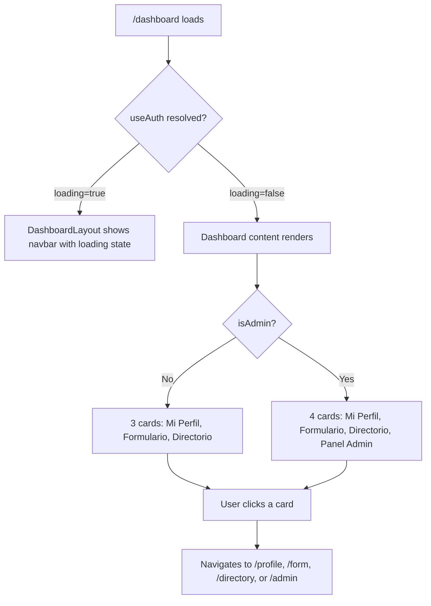
```mermaid
flowchart TD
    A["/dashboard loads"] --> B{"useAuth resolved?"}
    B -->|loading=true| C["DashboardLayout shows navbar with loading state"]
    B -->|loading=false| D["Dashboard content renders"]
    
    D --> E{"isAdmin?"}
    E -->|No| F["3 cards: Mi Perfil, Formulario, Directorio"]
    E -->|Yes| G["4 cards: Mi Perfil, Formulario, Directorio, Panel Admin"]
    
    F --> H["User clicks a card"]
    G --> H
    H --> I["Navigates to /profile, /form, /directory, or /admin"]
```

#### Dashboard Cards Detail
| Card | Icon | Destination | Available To |
|------|------|-------------|:------------:|
| Mi Perfil | UserCircle | `/profile` | All |
| Formulario: diagnóstico de partida | ClipboardList | `/form` | All |
| Directorio de CADs | Users | `/directory` | All |
| Panel Admin | ShieldCheck | `/admin` | Admin only |

#### Edge Cases
| Case | What Happens |
|------|-------------|
| Admin with no linked CAD clicks "Mi Perfil" | Profile page loads in admin-no-CAD mode (only team management) |
| CAD user with no linked CAD (orphaned mapping) | Profile page shows error: "No se ha podido localizar tu Centro" |
| Multiple sessions (same user, different tabs) | Each tab renders dashboard independently |

---

## J3. Navigation (Global)

### J3.1 Desktop Navigation

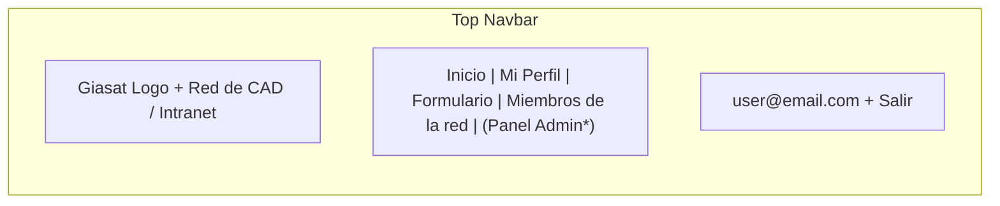
```mermaid
flowchart LR
    subgraph Header ["Top Navbar"]
        Logo["Giasat Logo + Red de CAD / Intranet"]
        Nav["Inicio | Mi Perfil | Formulario | Miembros de la red | (Panel Admin*)"]
        User["user@email.com + Salir"]
    end
```

- Active link: gold bg (`bg-accent`), bold, shadow
- Inactive link: gray text, hover → sand bg
- Admin-only "Panel Admin" link: appears only when `isAdmin === true`

### J3.2 Mobile Navigation

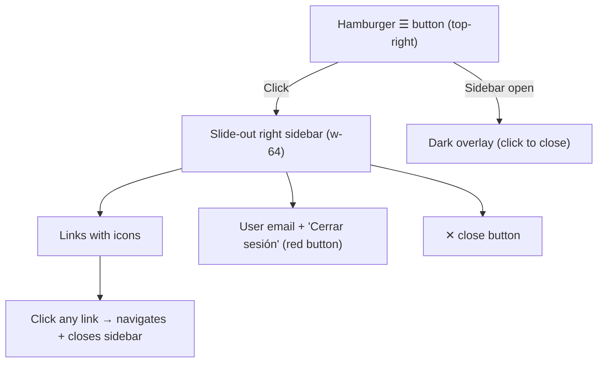
```mermaid
flowchart TD
    A["Hamburger ☰ button (top-right)"] -->|Click| B["Slide-out right sidebar (w-64)"]
    B --> C["Links with icons"]
    C --> D["Click any link → navigates + closes sidebar"]
    B --> E["User email + 'Cerrar sesión' (red button)"]
    B --> F["✕ close button"]
    A -->|Sidebar open| G["Dark overlay (click to close)"]
```

#### Mobile Sidebar States
| State | Visual |
|-------|--------|
| Closed | Hamburger icon visible, sidebar translated off-screen |
| Open | Sidebar slides in from right, dark backdrop overlay |
| Link click | Sidebar closes (`setIsMobileMenuOpen(false)`) then navigates |

### J3.3 Navigation Reachability Matrix

| From ↓ / To → | Login | Dashboard | Profile | Form | Form (success) | Directory | CAD Detail | Admin |
|:---------------|:-----:|:---------:|:-------:|:----:|:--------------:|:---------:|:----------:|:-----:|
| **Login** | — | ✅ submit | ❌ | ❌ | ❌ | ❌ | ❌ | ❌ |
| **Dashboard** | ✅ nav | — | ✅ card+nav | ✅ card+nav | ❌ | ✅ card+nav | ❌ | ✅* card+nav |
| **Profile** | ✅ nav | ✅ nav | — | ✅ nav | ❌ | ✅ nav | ❌ | ✅* nav |
| **Form** | ✅ nav | ✅ nav | ✅ nav | — | ✅ submit | ✅ nav | ❌ | ✅* nav |
| **Form (success)** | ✅ nav | ✅ nav+btn | ✅ nav | ❌ | — | ✅ nav | ❌ | ✅* nav |
| **Directory** | ✅ nav | ✅ nav | ✅ nav | ✅ nav | ❌ | — | ✅ click card | ✅* nav |
| **CAD Detail** | ✅ nav | ✅ nav | ✅ nav | ✅ nav | ❌ | ✅ back+nav | — | ✅* nav |
| **Admin** | ✅ nav | ✅ nav | ✅ nav+action | ✅ nav+action | ❌ | ✅ nav | ❌ | — |

*✅ = always accessible | ✅* = admin only | ❌ = not directly reachable*

---

# Part 2: CAD User Journeys

---

## J4. Profile Management (CAD User)

### J4.1 First-Time Profile Visit

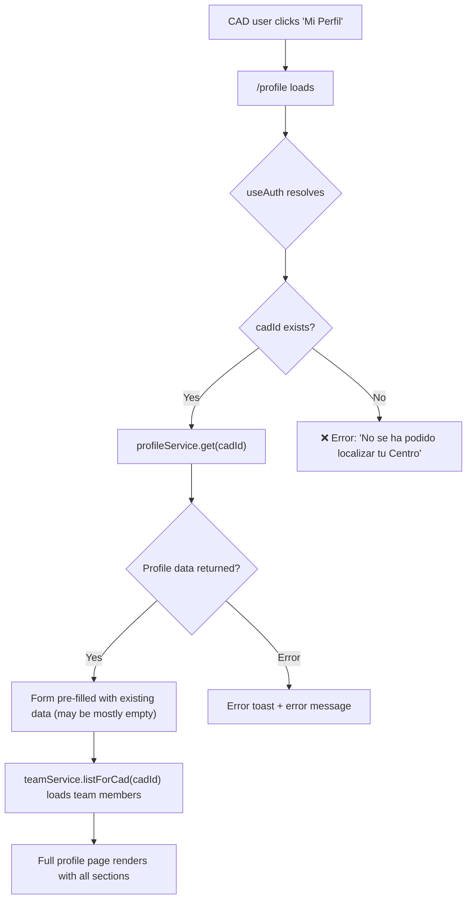
```mermaid
flowchart TD
    A["CAD user clicks 'Mi Perfil'"] --> B["/profile loads"]
    B --> C{"useAuth resolves"}
    C --> D{"cadId exists?"}
    D -->|Yes| E["profileService.get(cadId)"]
    D -->|No| F["❌ Error: 'No se ha podido localizar tu Centro'"]
    
    E --> G{"Profile data returned?"}
    G -->|Yes| H["Form pre-filled with existing data (may be mostly empty)"]
    G -->|Error| I["Error toast + error message"]
    
    H --> J["teamService.listForCad(cadId) loads team members"]
    J --> K["Full profile page renders with all sections"]
```

### J4.2 Profile Sections (What the User Can Edit)

The profile page has **6 distinct sections**, each containing specific fields:

#### Section 1: Basic Identity
| Field | Type | DB Column | Validation |
|-------|------|-----------|:----------:|
| Nombre Comercial | Text input | `nombre_comercial` | None |
| Descripción Corta | Textarea | `descripcion_corta` | None |
| Territorio | Text input | `territorio` | None |
| Email de Contacto | Text input | `email_contacto` | None (no email format check) |
| Teléfono | Text input | `telefono` | None |

#### Section 2: Structure
| Field | Type | DB Column |
|-------|------|-----------|
| Año de Constitución | Number input | `ano_constitucion` (parsed via `parseInt`) |
| Nº Socias Productoras | Number input | `num_socios_productoras` (parsed via `parseInt`) |
| Nº Personas Trabajadoras | Number input | `num_personas_trabajadoras` (parsed via `parseInt`) |
| Forma Jurídica | Text input | `forma_juridica` |
| Tipo de Gobernanza | Text input | `tipo_gobernanza` |
| Propiedad Instalaciones | Text input | `propiedad_instalaciones` |

#### Section 3: Team Profiles (Checkbox Multi-Select)
| Option | Meaning |
|--------|---------|
| Gerencia/Coordinación/Dirección | Leadership role |
| Técnica comercial y gestión de clientes | Sales & client relations |
| Producción y seguimiento en campo | Field operations |
| Almacén (calidad, logística) | Warehouse & quality |
| Gestión de pedidos | Order management |
| Dinamización social/gobernanza | Social governance |
| Administración y gestión interna | Admin |

#### Section 4: Maturity Self-Assessment (Matrix)
10 categories, each rated on a 4-level scale (🔴→🟡→🟢→⭐):
- Planificación productiva, Gestión comercial, Costes de producción, Logística, Calidad, Digitalización, Gobernanza interna, Marketing, Administración, Restauración colectiva

Plus two free-text fields:
- `madurez_fortalezas` (strengths)
- `madurez_cuellos_botella` (bottlenecks)

#### Section 5: Intercooperation Profile
| Field | Type |
|-------|------|
| Áreas donde compartir experiencia | Checkbox multi-select (10 options) |
| Áreas donde necesita apoyo | Checkbox multi-select (10 options) |
| Disposición a intercooperación | Text/select |
| Referentes técnicos | Text |

#### Section 6: Logo Upload
| Step | What Happens |
|------|-------------|
| User clicks upload area | File picker opens |
| File selected | **Validation**: M ust be image/*, max 2MB |
| Upload starts | `storageService.uploadLogo()` → Supabase Storage |
| Upload succeeds | Logo URL set in state, preview updates |
| Upload fails | Toast error |

### J4.3 Profile Save Flow

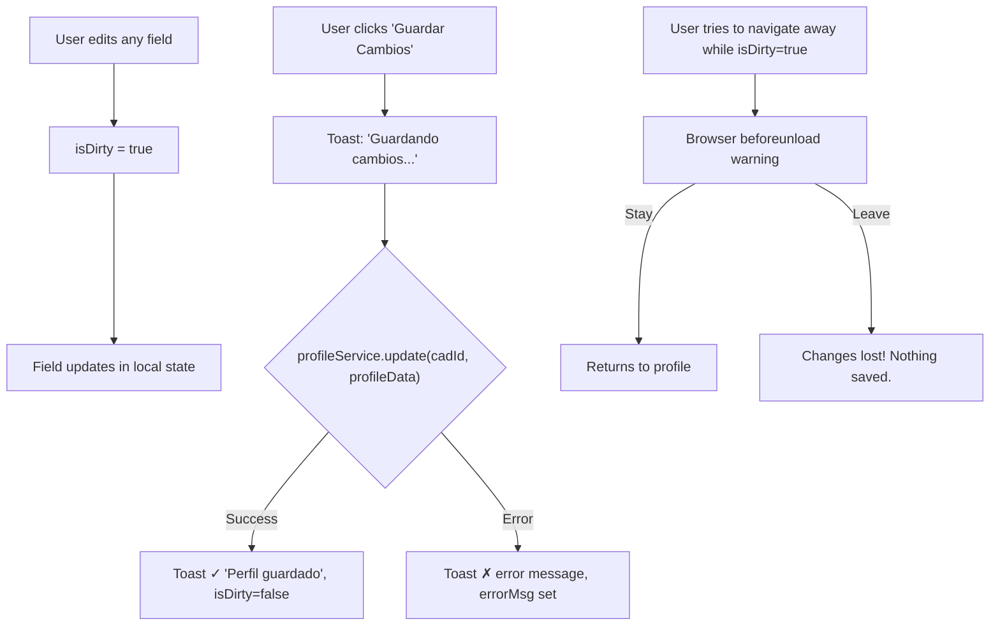
```mermaid
flowchart TD
    A["User edits any field"] --> B["isDirty = true"]
    B --> C["Field updates in local state"]
    
    D["User clicks 'Guardar Cambios'"] --> E["Toast: 'Guardando cambios...'"]
    E --> F{"profileService.update(cadId, profileData)"}
    F -->|Success| G["Toast ✓ 'Perfil guardado', isDirty=false"]
    F -->|Error| H["Toast ✗ error message, errorMsg set"]
    
    I["User tries to navigate away while isDirty=true"] --> J["Browser beforeunload warning"]
    J -->|Stay| K["Returns to profile"]
    J -->|Leave| L["Changes lost! Nothing saved."]
```

#### Edge Cases — Profile
| Case | Current Behavior |
|------|-----------------|
| Save empty form (all fields blank) | Saves successfully — creates profile with null/empty values |
| Paste very long text in descripción | Saves without truncation. UI does not warn about length |
| Upload non-image file | ✅ Now blocked (P4 fix) — toast error |
| Upload 50MB image | ✅ Now blocked (P4 fix) — toast error |
| Upload logo but don't click Save | Logo uploaded to storage but NOT linked to profile → orphaned file |
| Two tabs editing same profile | Last save wins — no conflict detection |
| Admin editing CAD profile while CAD user also editing | Last save wins — no locking |
| parseInt("abc") for año constitución | Results in `NaN` → saved as `null` (silent) |

### J4.4 Team Member Management (CAD)

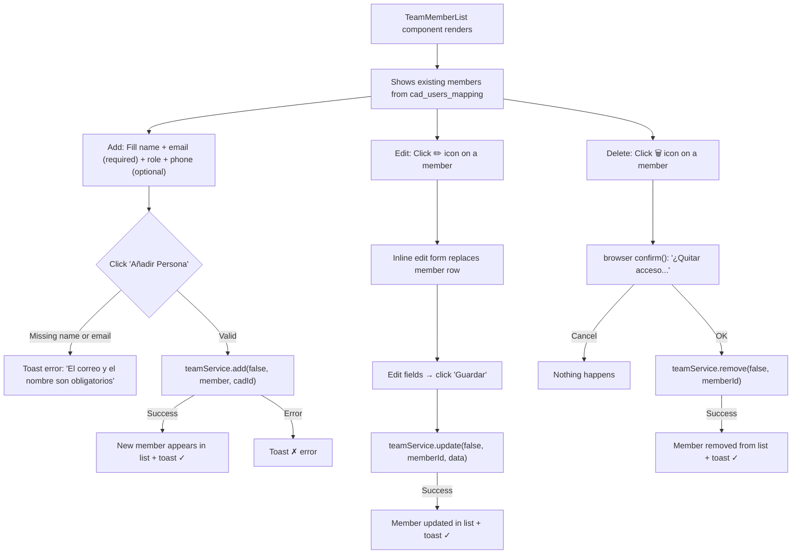
```mermaid
flowchart TD
    A["TeamMemberList component renders"] --> B["Shows existing members from cad_users_mapping"]
    
    B --> C["Add: Fill name + email (required) + role + phone (optional)"]
    C --> D{"Click 'Añadir Persona'"}
    D -->|Missing name or email| E["Toast error: 'El correo y el nombre son obligatorios'"]
    D -->|Valid| F["teamService.add(false, member, cadId)"]
    F -->|Success| G["New member appears in list + toast ✓"]
    F -->|Error| H["Toast ✗ error"]
    
    B --> I["Edit: Click ✏️ icon on a member"]
    I --> J["Inline edit form replaces member row"]
    J --> K["Edit fields → click 'Guardar'"]
    K --> L["teamService.update(false, memberId, data)"]
    L -->|Success| M["Member updated in list + toast ✓"]
    
    B --> N["Delete: Click 🗑️ icon on a member"]
    N --> O["browser confirm(): '¿Quitar acceso...'"]
    O -->|Cancel| P["Nothing happens"]
    O -->|OK| Q["teamService.remove(false, memberId)"]
    Q -->|Success| R["Member removed from list + toast ✓"]
```

#### Important: Team members ≠ login users
Adding someone to `cad_users_mapping` does **not** create a Supabase auth account. To let them log in, the admin must also create/reset their password from the Admin Panel.

---

## J5. Diagnostic Form (CAD User)

### J5.1 Form Initialization

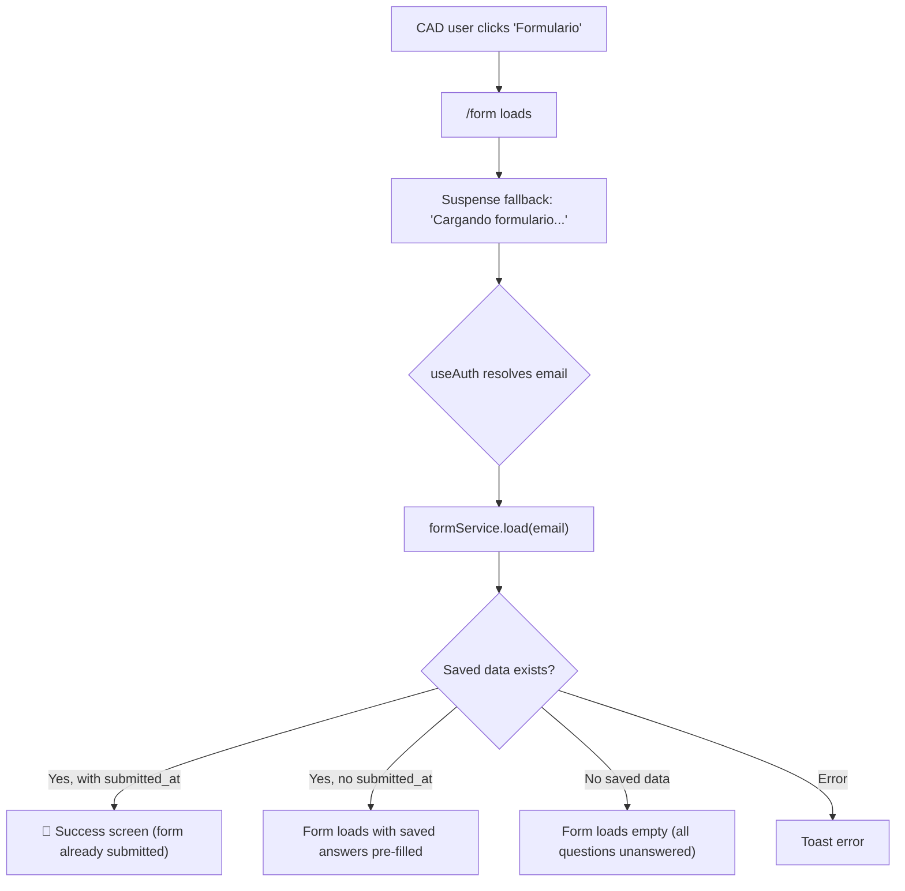
```mermaid
flowchart TD
    A["CAD user clicks 'Formulario'"] --> B["/form loads"]
    B --> C["Suspense fallback: 'Cargando formulario...'"]
    C --> D{"useAuth resolves email"}
    D --> E["formService.load(email)"]
    E --> F{"Saved data exists?"}
    F -->|Yes, with submitted_at| G["🌿 Success screen (form already submitted)"]
    F -->|Yes, no submitted_at| H["Form loads with saved answers pre-filled"]
    F -->|No saved data| I["Form loads empty (all questions unanswered)"]
    F -->|Error| J["Toast error"]
```

### J5.2 Form Structure

The form has **8 blocks** (0-7), containing a total of **53 questions** across **5 question types**:

| Block | Title | Questions | Key Topics |
|:-----:|-------|:---------:|------------|
| 0 | Validación ficha | 4 | Data validation, contact person |
| 1 | Gobernanza interna | 6 | Decision-making, coordination, internal dynamics |
| 2 | Modelo de negocio | 9 | Revenue, margins, channels, tools |
| 3 | Capacidad operativa | 12 | Planning, logistics, storage, software, challenges |
| 4 | Oferta y necesidades | 8 | Product families, surpluses, procurement |
| 5 | Calidad | 8 | Certifications, traceability, quality protocols |
| 6 | Identidad y comunicación | 4 | Branding, tools, communication channels |
| 7 | Expectativas y prioridades | 7 | Goals, priorities, commitment |

#### Question Types
| Type | Component | User Interaction |
|------|-----------|-----------------|
| `radio` | RadioQuestion | Select one option. May have `hasOther` (free text). May have `hasComment` (additional comment textarea) |
| `checkbox` | CheckboxQuestion | Select multiple options. May have `hasOther` + `hasComment` |
| `textarea` | TextQuestion | Free-form text input |
| `info` | InfoQuestion | Read-only informational text (no user input stored) |
| `matrix` | MatrixQuestion | Grid: categories × rating levels (used in maturity block if present) |

#### Conditional Logic (F3 fix)
| Question | Condition | Dependent |
|----------|-----------|-----------|
| Q0.1 | "¿Los datos de la ficha enviada son correctos?" | Q0.2 hidden unless answer contains "No" or "actualizar" |

### J5.3 Answering Questions — Complete Interaction Map

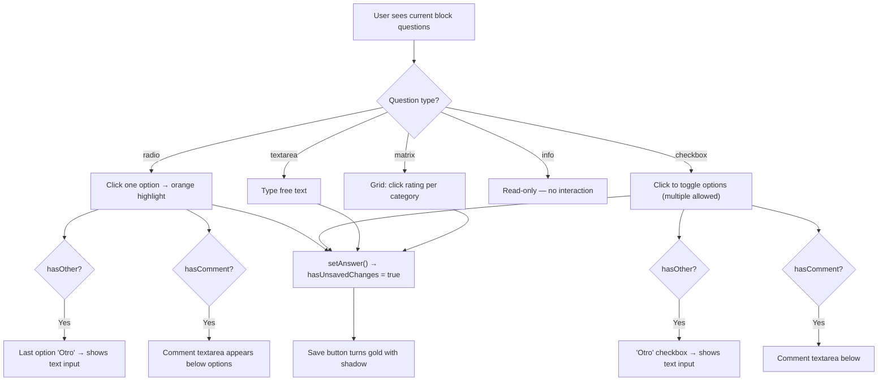
```mermaid
flowchart TD
    A["User sees current block questions"] --> B{"Question type?"}
    
    B -->|radio| C["Click one option → orange highlight"]
    C --> D{"hasOther?"}
    D -->|Yes| E["Last option 'Otro' → shows text input"]
    C --> F{"hasComment?"}
    F -->|Yes| G["Comment textarea appears below options"]
    
    B -->|checkbox| H["Click to toggle options (multiple allowed)"]
    H --> I{"hasOther?"}
    I -->|Yes| J["'Otro' checkbox → shows text input"]
    H --> K{"hasComment?"}
    K -->|Yes| L["Comment textarea below"]
    
    B -->|textarea| M["Type free text"]
    B -->|info| N["Read-only — no interaction"]
    B -->|matrix| O["Grid: click rating per category"]
    
    C & H & M & O --> P["setAnswer() → hasUnsavedChanges = true"]
    P --> Q["Save button turns gold with shadow"]
```

### J5.4 Form Navigation

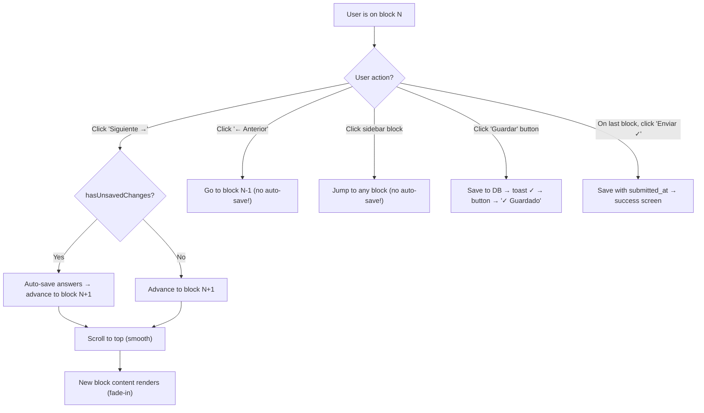
```mermaid
flowchart TD
    A["User is on block N"] --> B{"User action?"}
    
    B -->|"Click 'Siguiente →'"| C{"hasUnsavedChanges?"}
    C -->|Yes| D["Auto-save answers → advance to block N+1"]
    C -->|No| E["Advance to block N+1"]
    
    B -->|"Click '← Anterior'"| F["Go to block N-1 (no auto-save!)"]
    
    B -->|"Click sidebar block"| G["Jump to any block (no auto-save!)"]
    
    B -->|"Click 'Guardar' button"| H["Save to DB → toast ✓ → button → '✓ Guardado'"]
    
    B -->|"On last block, click 'Enviar ✓'"| I["Save with submitted_at → success screen"]
    
    D & E --> J["Scroll to top (smooth)"]
    J --> K["New block content renders (fade-in)"]
```

#### Sidebar Indicators
| Indicator | Meaning |
|-----------|---------|
| Gold background | Currently active block |
| ✓ (CheckCircle2 icon) | Block has at least one answered question |
| No icon | Block has no answers yet |
| Mobile scroll fade (right edge) | More blocks available off-screen |

#### Progress Bar
- **Tracks**: Total answered questions / total non-info questions
- **Display**: "X / Y preguntas respondidas"
- **Position**: Desktop sidebar only (hidden on mobile)

### J5.5 Form Save States

| State | Visual | When |
|-------|--------|------|
| No changes | Gray pill: "✓ Guardado" | After successful save, no new edits |
| Unsaved changes | Gold pill with shadow: "Guardar" | Any field changed since last save |
| Saving | Gold pill dimmed: "Guardando..." | During save API call |
| Save error | Toast ✗ with error message | API failure |
| Last saved timestamp | "Guardado a las HH:MM" below button | After successful save |

### J5.6 Form Submission (Final)

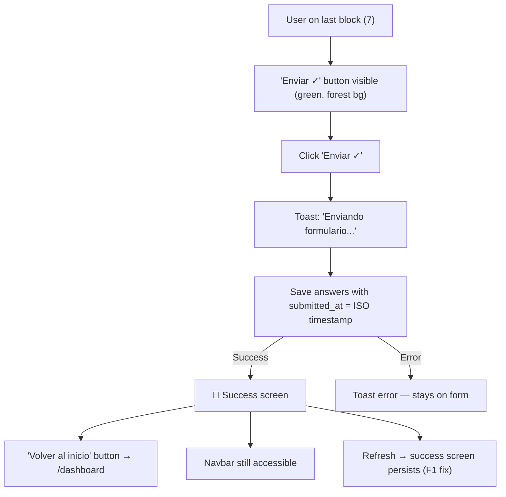
```mermaid
flowchart TD
    A["User on last block (7)"] --> B["'Enviar ✓' button visible (green, forest bg)"]
    B --> C["Click 'Enviar ✓'"]
    C --> D["Toast: 'Enviando formulario...'"]
    D --> E["Save answers with submitted_at = ISO timestamp"]
    E -->|Success| F["🌿 Success screen"]
    E -->|Error| G["Toast error — stays on form"]
    
    F --> H["'Volver al inicio' button → /dashboard"]
    F --> I["Navbar still accessible"]
    F --> J["Refresh → success screen persists (F1 fix)"]
```

### J5.7 Form Edge Cases

| Case | Current Behavior |
|------|-----------------|
| Submit completely empty form | ✅ Allowed — no required field enforcement |
| Navigate away mid-form with unsaved changes | ✅ `beforeunload` warning (F6 fix) |
| Browser back button mid-form | `beforeunload` fires if unsaved changes |
| Click sidebar block with unsaved changes | Navigates without saving (only "Siguiente →" auto-saves) |
| Admin views CAD form via `?cad_id=X` | Resolves CAD's mapped email → loads their answers |
| Admin edits + submits CAD's form | Same flow — submitted_at stored under CAD's email |
| Form load error (network) | Toast error, form shows but empty |
| Two users filling same CAD's form simultaneously | Last save wins (upsert on `user_email`) |
| Refresh after filling but not saving | All unsaved answers lost |
| Refresh after submit | ✅ Success screen persists (F1 fix: `submitted_at` checked on load) |

---

## J6. Directory Browsing (CAD User)

### J6.1 Directory List

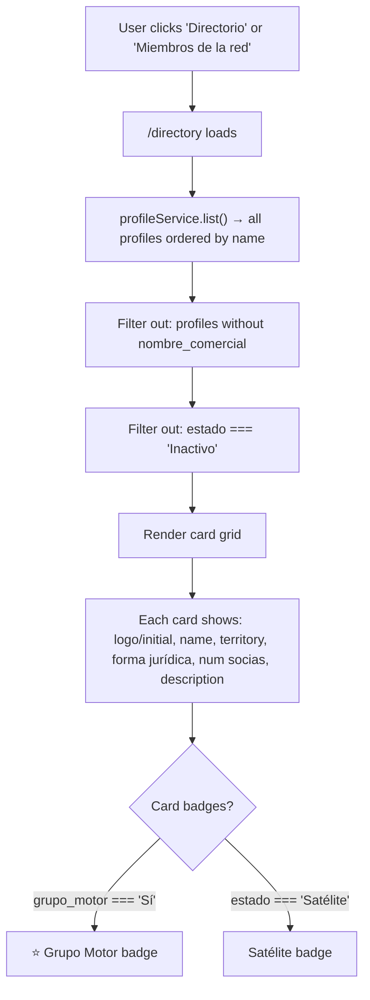
```mermaid
flowchart TD
    A["User clicks 'Directorio' or 'Miembros de la red'"] --> B["/directory loads"]
    B --> C["profileService.list() → all profiles ordered by name"]
    C --> D["Filter out: profiles without nombre_comercial"]
    D --> E["Filter out: estado === 'Inactivo'"]
    E --> F["Render card grid"]
    
    F --> G["Each card shows: logo/initial, name, territory, forma jurídica, num socias, description"]
    G --> H{"Card badges?"}
    H -->|grupo_motor === 'Sí'| I["⭐ Grupo Motor badge"]
    H -->|estado === 'Satélite'| J["Satélite badge"]
```

### J6.2 Search & Filter

```mermaid
flowchart TD
    A["Search box + Territory dropdown"] --> B{"User types in search?"}
    B -->|Yes| C["Filter by nombre_comercial OR descripcion_corta (case-insensitive)"]
    B -->|Clears search (✕ button)| D["Reset to all results"]
    
    A --> E{"User selects territory?"}
    E -->|Yes| F["Filter where territorio === selected"]
    E -->|'Todos los Territorios'| G["No territory filter"]
    
    C & F --> H{"Results?"}
    H -->|Some matches| I["Filtered card grid"]
    H -->|Zero matches| J["Empty state: 'No se encontraron perfiles' + 'Limpiar filtros' button"]
    
    J --> K["Click 'Limpiar filtros'"] --> L["Both search and territory reset"]
```

#### Territory Dropdown
- Populated dynamically from `[...new Set(cads.map(c => c.territorio).filter(Boolean))]`
- If no CADs have territory set → dropdown has only "Todos los Territorios"

### J6.3 CAD Detail Page

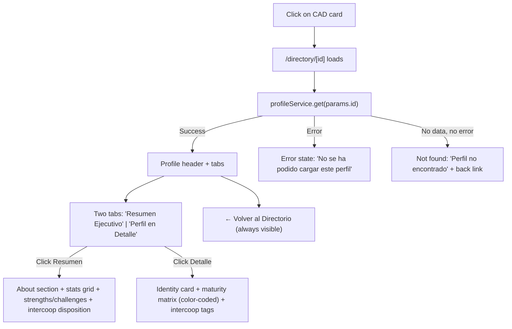
```mermaid
flowchart TD
    A["Click on CAD card"] --> B["/directory/[id] loads"]
    B --> C["profileService.get(params.id)"]
    C -->|Success| D["Profile header + tabs"]
    C -->|Error| E["Error state: 'No se ha podido cargar este perfil'"]
    C -->|No data, no error| F["Not found: 'Perfil no encontrado' + back link"]
    
    D --> G["Two tabs: 'Resumen Ejecutivo' | 'Perfil en Detalle'"]
    G -->|Click Resumen| H["About section + stats grid + strengths/challenges + intercoop disposition"]
    G -->|Click Detalle| I["Identity card + maturity matrix (color-coded) + intercoop tags"]
    
    D --> J["← Volver al Directorio (always visible)"]
```

#### Resumen Ejecutivo Tab
| Section | Shows |
|---------|-------|
| Sobre la Organización | `descripcion_corta` or "Esta agrupación aún no ha proporcionado una descripción." |
| Key Stats Grid (2-3 cols) | territorio, forma jurídica, socias, año constitución, personas, gobernanza |
| Mayores Fortalezas | `madurez_fortalezas` or "Pendiente de completar" |
| Mayores Retos | `madurez_cuellos_botella` or "Pendiente de completar" |
| Disposición a Red | `intercoop_disposicion` or "Pendiente de completar" |

#### Perfil en Detalle Tab
| Section | Shows |
|---------|-------|
| Ficha de Identidad (left col) | email, phone, forma jurídica, año, socias, personas, gobernanza |
| Maturity Matrix (right col) | All 10 categories with color-coded values (🔴🟡🟢) + fortalezas/retos |
| Intercooperation Profile | Tags: "compartir experiencia en" + "necesita apoyo en" + disposición + referentes |

#### Edge Cases — Directory Detail
| Case | What Happens |
|------|-------------|
| CAD has no maturity data | "Evaluación de madurez pendiente de completar" |
| CAD has no intercoop data | "Información pendiente de completar" |
| Invalid UUID in URL | profileService.get() throws → error state |
| CAD deleted after directory was loaded | Detail page shows error on load |

---

# Part 3: Admin-Only Journeys

---

## J7. Admin Panel — CAD Management

### J7.1 Access Control

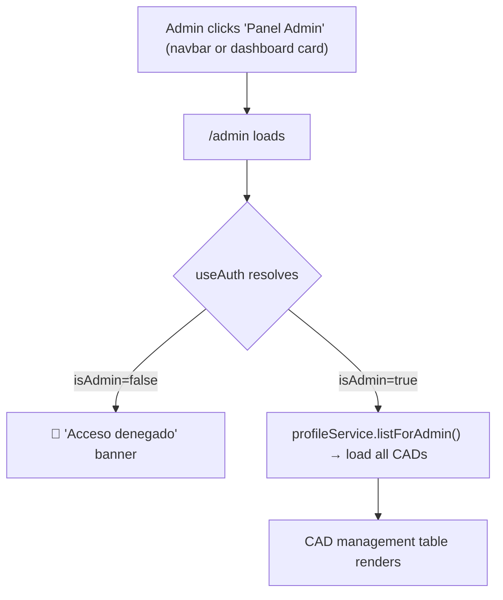
```mermaid
flowchart TD
    A["Admin clicks 'Panel Admin' (navbar or dashboard card)"] --> B["/admin loads"]
    B --> C{"useAuth resolves"}
    C -->|isAdmin=false| D["🔴 'Acceso denegado' banner"]
    C -->|isAdmin=true| E["profileService.listForAdmin() → load all CADs"]
    E --> F["CAD management table renders"]
```

### J7.2 CAD Table

| Column | Data | Source |
|--------|------|--------|
| Name | `nombre_comercial` | `cad_profiles` |
| Territory | `territorio` | `cad_profiles` |
| Status | `estado` (Activo/Inactivo/Satélite) | `cad_profiles` |
| Actions | 4 buttons per row | — |

#### Actions Per CAD Row

| Action | Button | What Happens |
|--------|--------|-------------|
| **Ver Perfil** | Link icon | `router.push('/profile?cad_id=X')` → opens profile in admin-edit mode |
| **Formulario** | ClipboardList icon | `router.push('/form?cad_id=X')` → opens CAD's diagnostic form |
| **🔑 Contraseña** | KeyRound icon | Opens password reset modal (J7.4) |
| **🗑️ Eliminar** | Trash2 icon | Triggers deletion flow (J7.5) |

### J7.3 Create New CAD

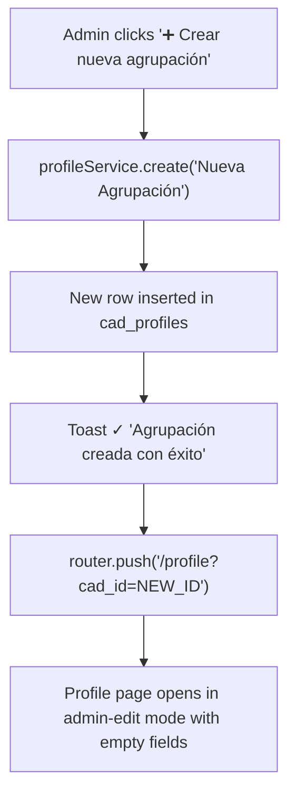
```mermaid
flowchart TD
    A["Admin clicks '➕ Crear nueva agrupación'"] --> B["profileService.create('Nueva Agrupación')"]
    B --> C["New row inserted in cad_profiles"]
    C --> D["Toast ✓ 'Agrupación creada con éxito'"]
    D --> E["router.push('/profile?cad_id=NEW_ID')"]
    E --> F["Profile page opens in admin-edit mode with empty fields"]
```

#### Edge Cases
| Case | What Happens |
|------|-------------|
| Create fails (DB error) | Toast error, stays on admin page |
| After creating, admin needs to return to admin panel | Must use navbar — no back button in profile |

### J7.4 Password Reset Flow

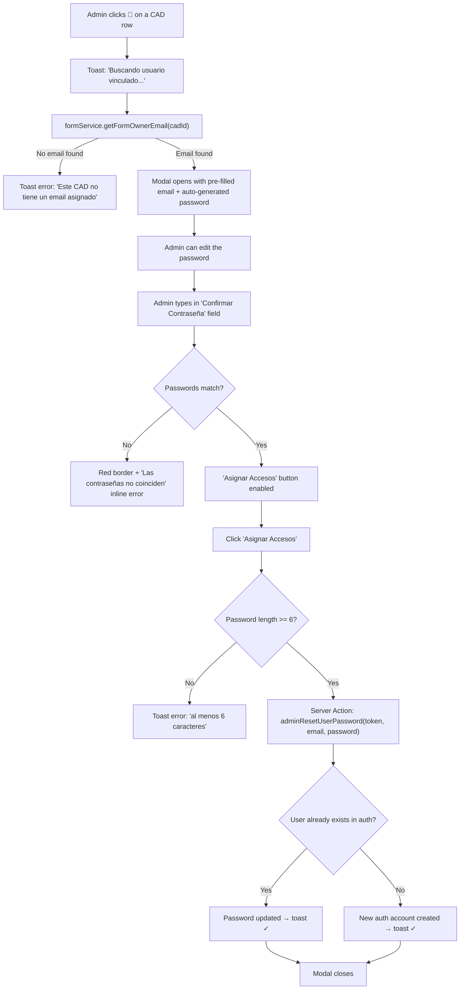
```mermaid
flowchart TD
    A["Admin clicks 🔑 on a CAD row"] --> B["Toast: 'Buscando usuario vinculado...'"]
    B --> C["formService.getFormOwnerEmail(cadId)"]
    C -->|No email found| D["Toast error: 'Este CAD no tiene un email asignado'"]
    C -->|Email found| E["Modal opens with pre-filled email + auto-generated password"]
    
    E --> F["Admin can edit the password"]
    F --> G["Admin types in 'Confirmar Contraseña' field"]
    G --> H{"Passwords match?"}
    H -->|No| I["Red border + 'Las contraseñas no coinciden' inline error"]
    H -->|Yes| J["'Asignar Accesos' button enabled"]
    
    J --> K["Click 'Asignar Accesos'"]
    K --> L{"Password length >= 6?"}
    L -->|No| M["Toast error: 'al menos 6 caracteres'"]
    L -->|Yes| N["Server Action: adminResetUserPassword(token, email, password)"]
    
    N --> O{"User already exists in auth?"}
    O -->|Yes| P["Password updated → toast ✓"]
    O -->|No| Q["New auth account created → toast ✓"]
    
    P & Q --> R["Modal closes"]
```

#### Auto-Generated Password Pattern
```
[FirstPartOfEmail (capitalized)][CurrentYear]!
Example: coordinacion@ekoalde.org → Coordinacion2026!
```

#### Email Resolution Order
1. `cad_users_mapping.user_email` (first match for this `cad_id`)
2. Fallback: `cad_profiles.email_contacto`
3. If neither exists → error toast

### J7.5 CAD Deletion Flow

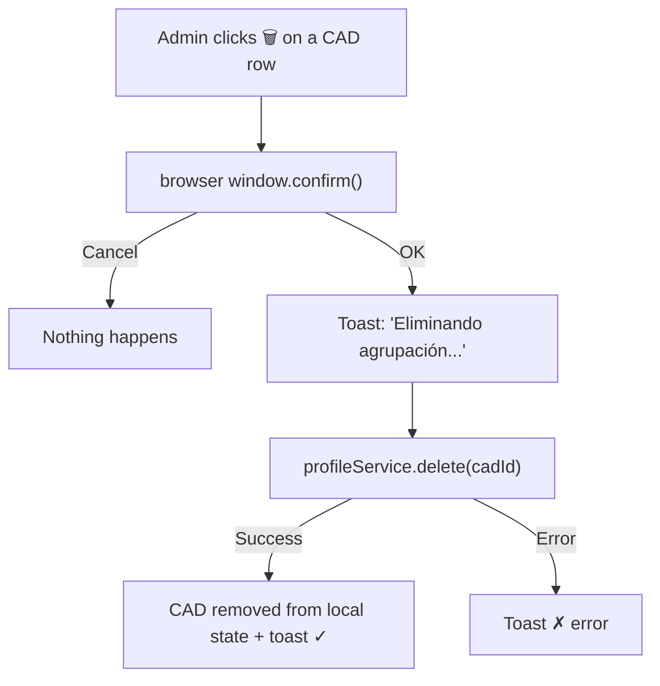
```mermaid
flowchart TD
    A["Admin clicks 🗑️ on a CAD row"] --> B["browser window.confirm()"]
    B -->|Cancel| C["Nothing happens"]
    B -->|OK| D["Toast: 'Eliminando agrupación...'"]
    D --> E["profileService.delete(cadId)"]
    E -->|Success| F["CAD removed from local state + toast ✓"]
    E -->|Error| G["Toast ✗ error"]
```

> ⚠️ This is permanent and irreversible. No undo. All associated data (users, forms) may be orphaned depending on DB cascade rules.

### J7.6 Admin Team Management

Located **below the CAD table** on the admin page.

```mermaid
flowchart TD
    A["Scroll to 'Equipo Secretaría Técnica' section"] --> B["teamService.listAdmins() loads"]
    B --> C["TeamMemberList component renders with admin_users_mapping data"]
    
    C --> D["Same CRUD as CAD team (J4.4) but targets admin_users_mapping table"]
    D --> E["Add: name + email + role + phone → teamService.add(true, member)"]
    D --> F["Edit: inline form → teamService.update(true, memberId, data)"]
    D --> G["Delete: confirm → teamService.remove(true, memberId)"]
```

### J7.7 Admin Cross-View: Editing a CAD's Profile

```mermaid
flowchart TD
    A["Admin clicks 'Ver Perfil' on CAD row"] --> B["/profile?cad_id=X loads"]
    B --> C["Profile page detects targetCadId from URL"]
    C --> D["profileService.get(targetCadId) — loads that CAD's profile"]
    D --> E["Same edit form as CAD user sees"]
    E --> F["Admin can edit ALL fields + team members"]
    F --> G["Save → profileService.update(targetCadId, data)"]
```

### J7.8 Admin Cross-View: Viewing/Editing a CAD's Form

```mermaid
flowchart TD
    A["Admin clicks 'Formulario' on CAD row"] --> B["/form?cad_id=X loads"]
    B --> C["Form page detects targetCadId"]
    C --> D["formService.getFormOwnerEmail(cadId) → resolves email"]
    D --> E["formService.load(resolvedEmail) → loads that CAD's answers"]
    E --> F["Admin sees the form with CAD's saved answers"]
    F --> G["Admin can edit answers + save + even submit on their behalf"]
```

---

# Part 4: Complete Admin Onboarding Workflow

This is the end-to-end flow an admin follows to onboard a brand new CAD:

```mermaid
flowchart TD
    A["Admin logs in"] --> B["/dashboard → click 'Panel Admin'"]
    B --> C["Click '➕ Crear nueva agrupación'"]
    C --> D["New CAD created → redirected to /profile?cad_id=NEW"]
    D --> E["Admin fills in: name, territory, description, contact email"]
    E --> F["Admin clicks 'Guardar Cambios'"]
    F --> G["Admin navigates back to admin panel (navbar)"]
    G --> H["Click 🔑 on new CAD row"]
    H --> I["Modal: email resolved from profile's email_contacto"]
    I --> J["Set password + confirm → 'Asignar Accesos'"]
    J --> K["Auth account created (or updated)"]
    K --> L["Admin shares credentials with CAD via email/phone"]
    L --> M["CAD user logs in for first time"]
    M --> N["/dashboard → profile (fill details) → form (fill diagnostic)"]
```

**Total admin clicks for onboarding**: ~10 (create → fill basics → save → back → reset password → confirm)

---

# Part 5: Edge Cases & Error Scenarios

## E1. Network & Connectivity

| Scenario | Pages Affected | Behavior |
|----------|---------------|----------|
| Offline during initial load | All | `LoadingSpinner` stuck, no timeout → infinite loading |
| Offline during save | Profile, Form | `supabase.from().update()` throws → toast error |
| Offline during navigation | All | Page loads from cache, API calls fail silently or with toast |
| Slow connection (>5s) | All | Spinner shown, no skeleton. User may click away |
| API returns 500 | All | Service throws → toast error or error state |

## E2. Concurrent Editing

| Scenario | Behavior |
|----------|----------|
| Two tabs editing same profile | Last save wins — no warning |
| Admin + CAD user editing same profile | Last save wins — no locking |
| Admin + CAD user filling same form | Last save wins (upsert on `user_email`) |
| Team member CRUD from two sessions | Both succeed independently; list may be stale in one tab |

## E3. Data Integrity

| Scenario | Behavior |
|----------|----------|
| `cadId` in URL doesn't exist | profileService.get() throws → error state |
| User mapped to non-existent CAD | Profile page shows error |
| No CAD mapping for user email | `cadId = null` → profile shows error (CAD user) or admin team view (admin) |
| Duplicate entries in cad_users_mapping | First match used (`.limit(1)`) |
| Team member email conflicts with login email | No validation — can add any email |

## E4. Session Lifecycle

| Scenario | Behavior |
|----------|----------|
| JWT token expires silently | Next API call fails → user sees error, may need to refresh and re-login |
| User closes browser, returns next day | Session may persist (Supabase default) or require re-login |
| Multiple devices logged in | All active simultaneously, no conflict |
| Password changed by admin while CAD user logged in | Current session continues until JWT expires |

## E5. Mobile-Specific

| Scenario | Behavior |
|----------|----------|
| Form footer on phone with notch | `safe-area-inset-bottom` padding applied |
| Form sidebar on phone (8 blocks) | Horizontal scroll with fade hint |
| Mobile keyboard opens (textarea question) | Footer may be pushed up or overlap |
| Directory cards on narrow screen | Single column, logo centered above text |
| Profile matrix on phone | Grid may overflow horizontally |

---

# Part 6: End-to-End Test Scenarios

| # | Actor | Scenario | Steps | Expected | Risk |
|:-:|:-----:|----------|-------|----------|:----:|
| 1 | CAD | **Full lifecycle** | Login → Profile (fill all) → Save → Form (complete 8 blocks) → Submit → Directory (see self) | All data visible in directory | F1 |
| 2 | CAD | **Partial save + resume** | Form → Fill 3 blocks → Save → Logout → Login → Form | Saved answers loaded, unsaved lost | ✅ |
| 3 | CAD | **Navigate away mid-form** | Form → Answer questions → Click "Mi Perfil" | `beforeunload` warning | F6 |
| 4 | CAD | **Upload logo flow** | Profile → Upload PNG (1MB) → See preview → Save | Logo visible in directory | P4 |
| 5 | CAD | **Upload invalid file** | Profile → Upload .pdf file | Error toast, upload blocked | P4 |
| 6 | CAD | **Browse + search directory** | Directory → Type "Ekoalde" → See filtered results → Clear ✕ → See all | Search + clear works | G9 |
| 7 | CAD | **Empty search** | Directory → Type "xyznonexistent" | "No se encontraron perfiles" + "Limpiar filtros" | G10 |
| 8 | CAD | **View CAD detail** | Directory → Click card → See Resumen → Click Detalle → See matrix | Both tabs load | ✅ |
| 9 | CAD | **Team member CRUD** | Profile → Add member → Edit member → Delete member | All operations succeed | ✅ |
| 10 | CAD | **Conditional question** | Form block 0 → Answer Q0.1 "Sí" → Q0.2 hidden. Answer "No" → Q0.2 appears | Conditional logic works | F3 |
| 11 | Admin | **Complete onboarding** | Login → Admin → Create → Fill profile → Save → Reset password → New CAD logs in | Full circuit works | Nav gap |
| 12 | Admin | **Reset password** | Admin → Click 🔑 → Enter password → Confirm → Submit | User can login with new password | G7 |
| 13 | Admin | **Password mismatch** | Reset modal → Type different passwords | Red border + inline error | G7 |
| 14 | Admin | **View CAD's form** | Admin → Click "Formulario" on CAD row | See CAD's saved answers | ✅ |
| 15 | Admin | **Delete CAD** | Admin → Click 🗑️ → Confirm → CAD removed | CAD gone from table | G1 |
| 16 | Admin | **Dashboard admin card** | Login as admin → Dashboard shows 4 cards | "Panel Admin" card visible | F2 |
| 17 | Both | **Logout flow** | Click "Salir" → Redirect to /login | Clean logout | ✅ |
| 18 | Both | **Session in other tab** | Open two tabs → Logout in one | Both redirect to /login | ✅ |
| 19 | CAD | **Form already submitted** | Login → Click "Formulario" → See success screen (not the form) | submitted_at persisted | F1 |
| 20 | Admin | **Admin without linked CAD** | Login as admin with no cad_users_mapping → Click "Mi Perfil" | Shows team management only | ✅ |
